# The analysis between tsunami and earthquack factors

Student Name: Yesheng Guan

Student affiliation: Brown University DSI

Link to github: https://github.com/Helix-G123/Tsunami_earthquack_prediction.git

## Introduction

This project aims to predict if the tsunami will happen based on earthquacks factors.

The dataset is download from Kaggle, where you can find the url in the Citation part. It contains 782 earthquakes data and 22 years period from January 1, 2001 to December 31, 2022.

Here are the descriptions for every features:

- magnitude: Earthquake magnitude (Richter scale)
- cdi: Community Decimal Intensity (felt intensity)
- mmi: Modified Mercalli Intensity (instrumental)
- sig: Event significance score
- nst: Number of seismic monitoring stations
- dmin: Distance to nearest seismic station (degrees)
- gap: Azimuthal gap between stations (degrees)
- depth: Earthquake focal depth (km)
- latitude: Epicenter latitude (WGS84)
- longitude: Epicenter longitude (WGS84)
- Year: Year of occurrence
- Month: Month of occurrence
- tsunami: Tsunami potential (TARGET)

I choose this dataset as my project because I had been studied in University of California, Santa Barbara. In California, earthquacks are very frequent compared to other states. When an earthquack happend, I and my friends would say "Do you think the tsunami will come or not". So, I believe this project is interesting for those people who had living experience in California.

## EDA

The first thing in EDA is to look at if correlation exists. Here is the correlation matrix:

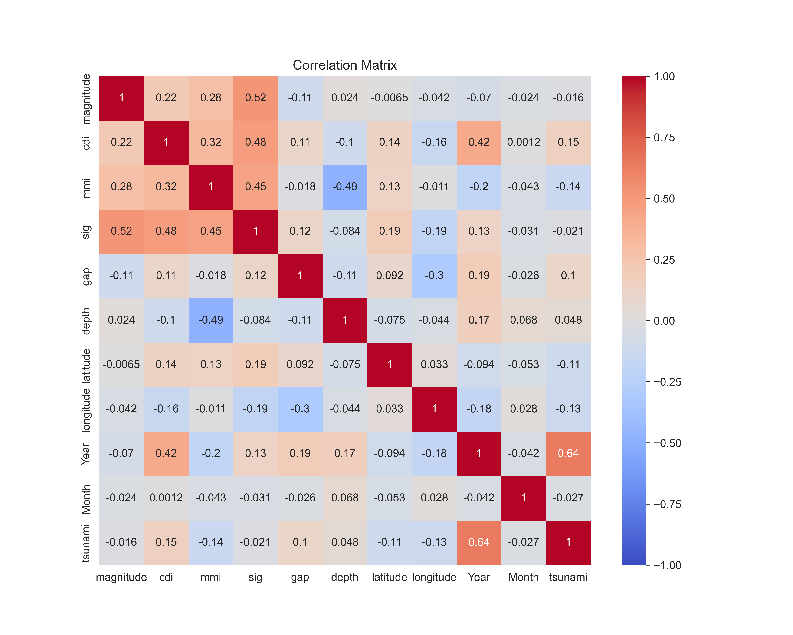

It is very interesting that the influence of magnitude to tsunami is not very strong as other features such as cdi or Year. And contradicting to common sense, Year is strongly positively connected to tsunami.

Based on the above desctriptions, we found that dmin and nst are two useless features. This is because seismic monitoring station may be builded after scientists found the earthquack and tsunami is strongly connected. Therefore, we have to remove thes two features.

The good news is that our features are almost linear independent, which is very useful for following model training.

Lets take a look to the pairwise_relationships for three features I though are interesting:

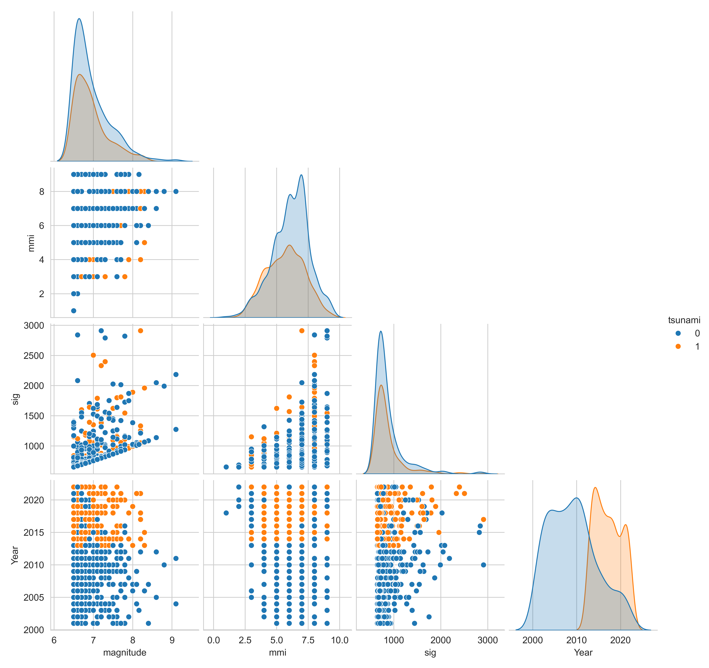

From this pictures we can find that tsunami is more frequent in the earthquack area where magnitude and sig are both large. Also, tsunami happens more frequent after 2010. 

Here is the distribution of each feature:
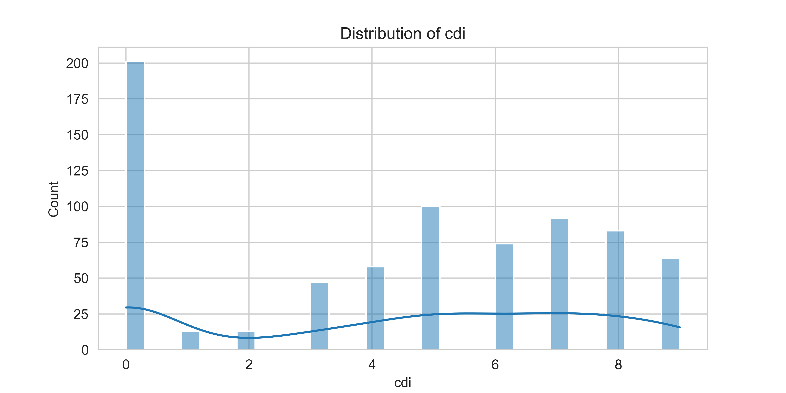

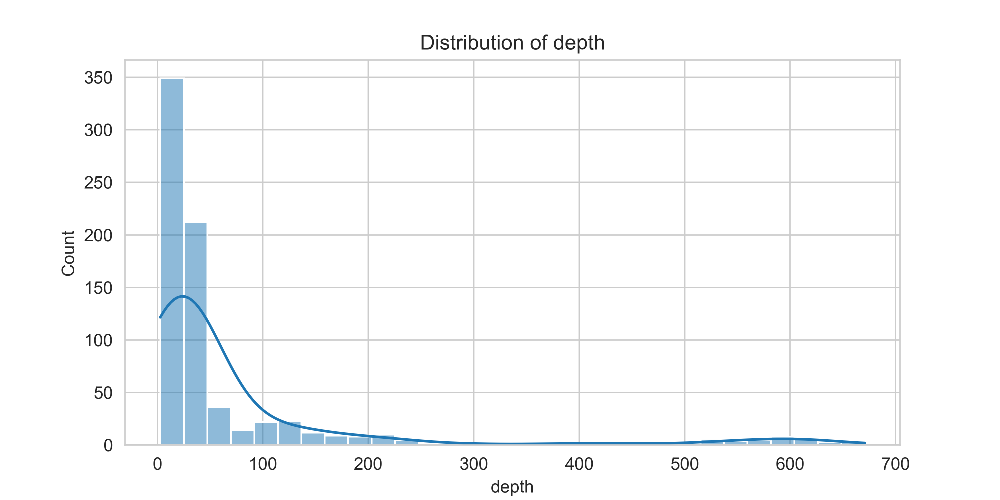

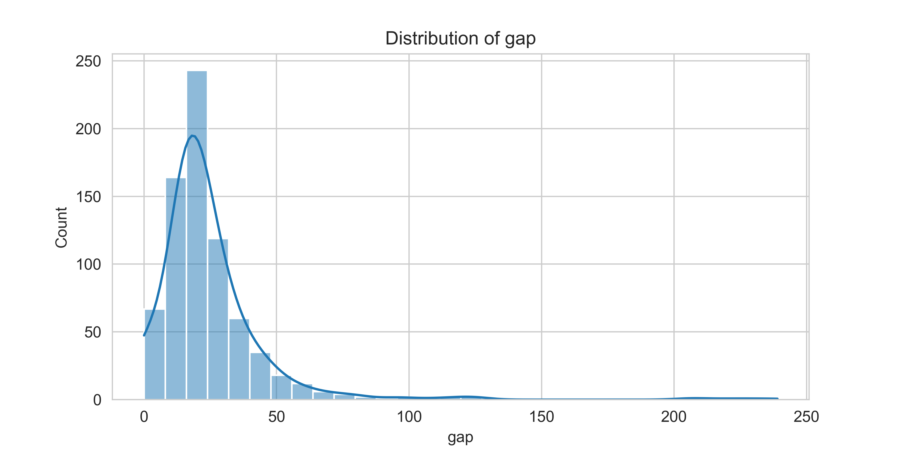

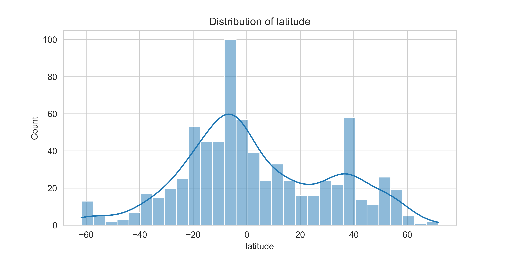

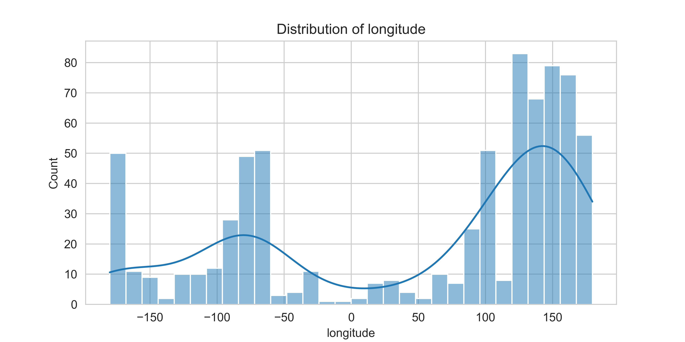

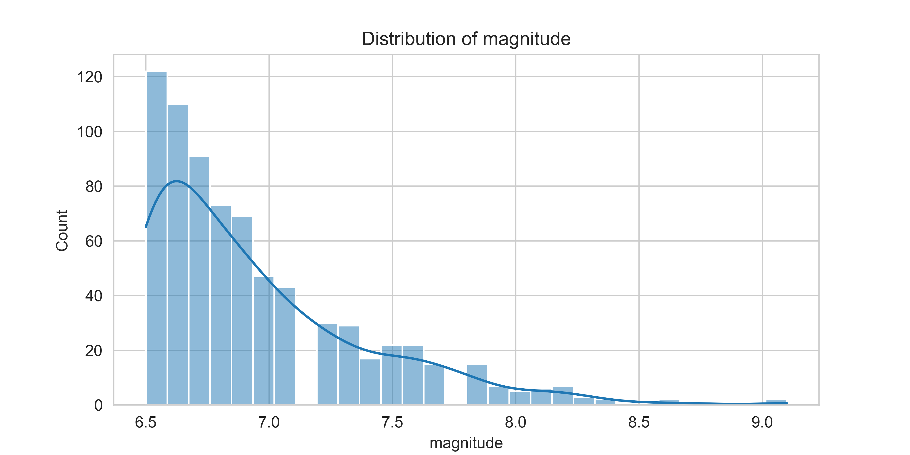

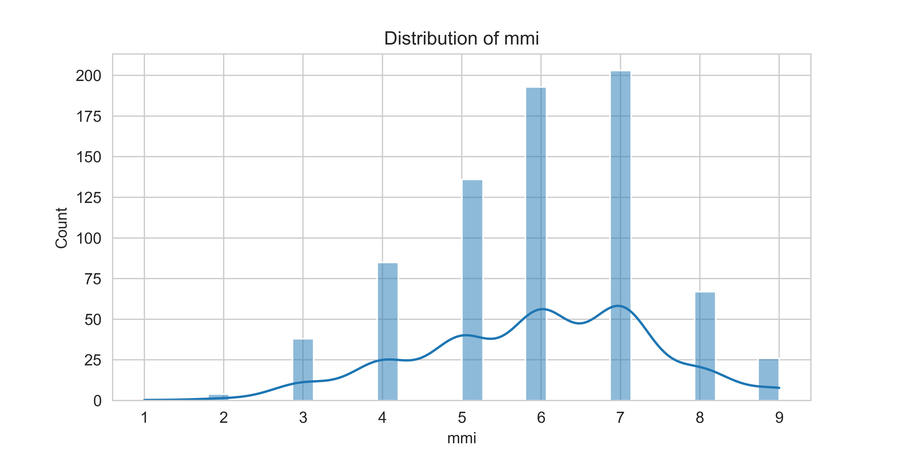

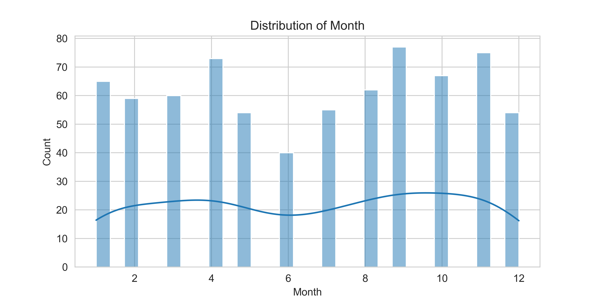

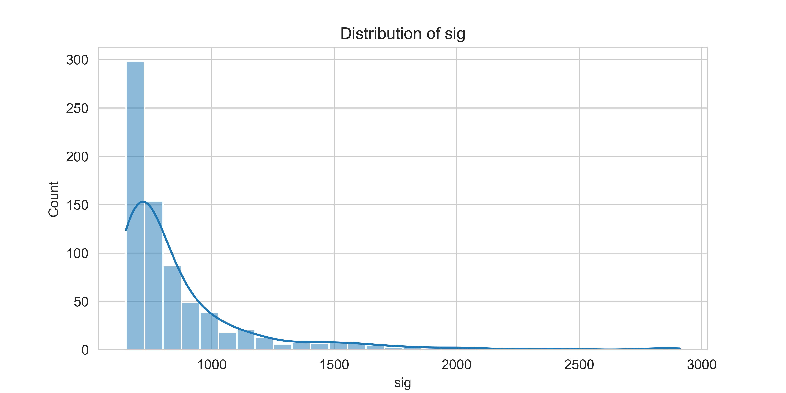

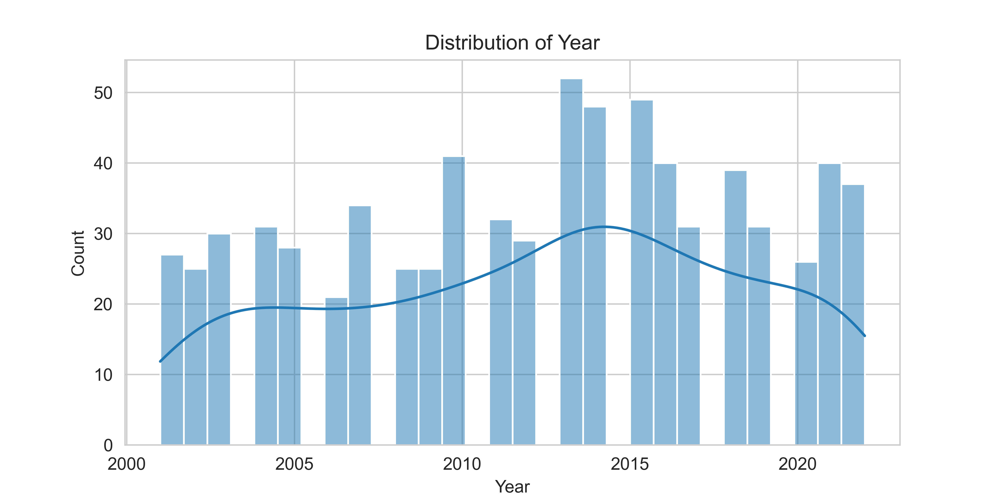

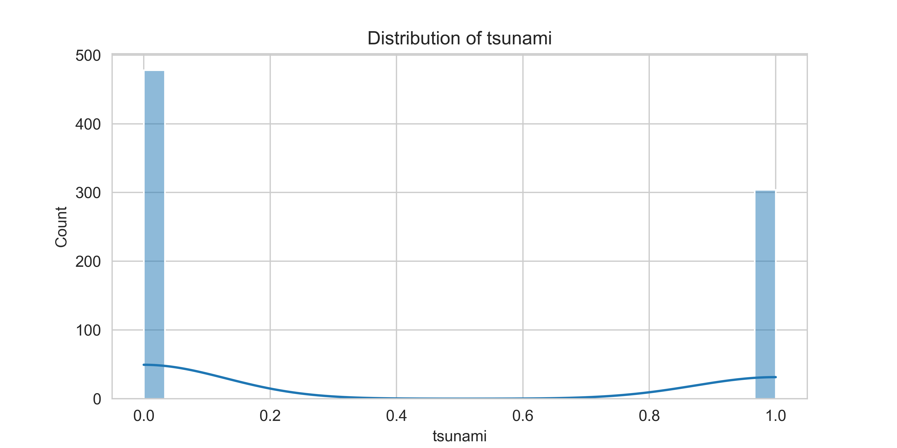

We can find that most data are evenly distributed. In other words, extreme value is infrequent.

Now, let's focus on the missing value:
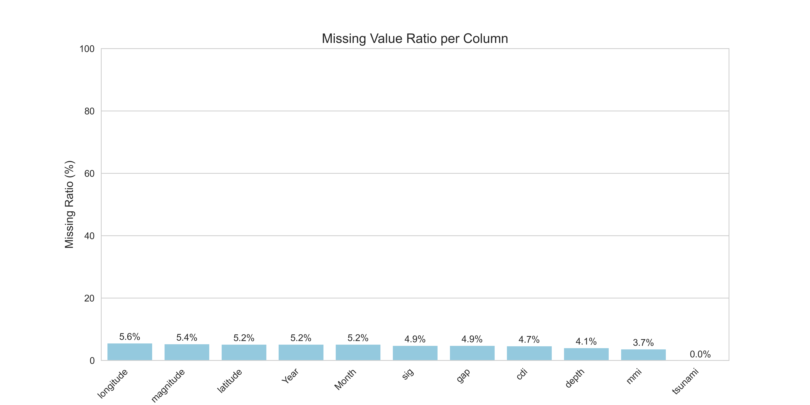

The good news is that the tsunami has no missing value. For other parts, the missing rates are about 5 percentage.

For features excepts Year and Month, we can directly use mod to fill the NA values.

For Year and Month, they are special since time series exsits. So, using the forward filling might be more appropriate. 

## Methods

In order to cancel the impact of different range of value, we need to use the StandardScaler and MinMaxScaler. 

For features such as 'magnitude', 'depth', 'cdi', 'mmi', 'sig', 'gap', 'latitude', 'longitude', they are numeric and can used the StandardScaler.

For features Year and Month, they are ordinal features and contains time series. MinMaxScaler is a good way to limit their value range.

Now, we need to split the train the test dataset. By setting stratify to the target variable, we are able to control the ratio of tsunami yes and tsunami no sample even distributed. Also, we set the spliting ratio to 0.2.

As for the train and validation set, I decided to use k-fold validation and set k to 5. This means each time, 80% samples would be used to train and 20% samples would be used to validate in the train set.

Before going to the training part, I would like to introduce more details:

The majority is 0, which means most samples are no tsunami.

The metrics I choosed are:

- Accuracy: Baseline measure of overall correctness (but limited for imbalance).
- Weighted F1-Score: Harmonic mean of precision/recall (weighted by class size, balances performance across majority/minority classes).
- F2-Score: Prioritizes recall (β=2) — critical for tsunami prediction, where false negatives (missed tsunamis) have higher real-world costs.
- AUC-ROC: Measures the model’s ability to distinguish between classes (robust to class imbalance, ideal for binary prediction).

Obviously, the result is not so good.

As for the model selection, I tested 4 algorithms:

- Logistic Regression (Linear): Default params (max_iter=1000, random_state=42).
- Decision Tree (Nonlinear): Default params (random_state=42).
- Random Forest (Nonlinear): Tuned n_estimators (candidates: 50, 100, 200, 300) — optimal = 200 (balances performance/computational cost).
- XGBoost (Nonlinear): Tuned n_estimators (candidates: 50, 100, 200, 300) — optimal = 50 (avoids overfitting).

Also, I quantified two sources of uncertainty:

- Splitting Uncertainty (split_std): Std of metrics across 5 folds (captures variability from data partitioning).
- Non-Deterministic Uncertainty (non_det_std): Std of fold-averaged metrics across 5 repeats (captures variability from randomness in tree-based models like Random Forest).

## Results

The baseline (majority-class prediction of "no tsunami") achieves:

- Accuracy = 0.6112,
- Weighted F1 = 0.4637
- F2 = 0.5422
- AUC-ROC = 0.5.

All models outperform the baseline significantly (measured by standard deviations above baseline):

- Logistic Regression: 6.61 (accuracy) → 18.48 (AUC) stds above baseline;
- Decision Tree: 10.90 (accuracy) → 14.31 (AUC) stds above baseline;
- Random Forest: 15.23 (accuracy) → 34.00 (AUC) stds above baseline;
- XGBoost: 13.62 (accuracy) → 34.59 (AUC) stds above baseline.

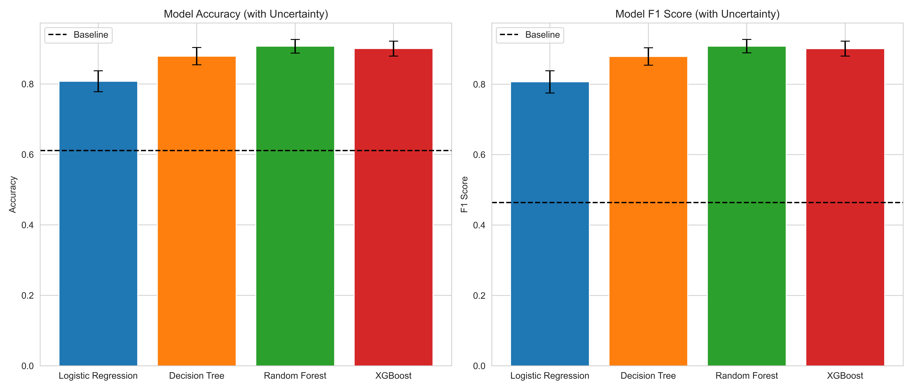

For above figure, Random Forest and XGBoost are the most predictive models:

- Both achieve ~0.90–0.91 in accuracy/F1 (far higher than linear models/decision trees)
- They have the smallest uncertainty (narrow error bars);
- Random Forest's accuracy and F1 score are slightly higher than XGBoost. 

Here are the detailed model performance table:

| Model | accuracyAccuracy (mean±std) | F1 (mean±std) | F-2 (mean±std) | AUC (mean±std) | Std above baseline (Accuracy)|
|---------|---------|---------|---------|---------|---------|
| Logistic Regression   | 0.8080 ± 0.0298   | 0.8068 ± 0.0315   | 0.8070 ± 0.0308 | 0.8920 ± 0.0212| 6.61 |
| Decision Tree   | 0.8791 ± 0.0246   | 0.8788 ± 0.0247   | 0.8787 ± 0.0248|0.8708 ± 0.0259|10.90|
| Random Forest   | 0.9073 ± 0.0194   | 0.9082 ± 0.0192   |0.9068 ± 0.0197|0.9594 ± 0.0135|15.23|
| XGBoost  | 0.9007 ± 0.0212   |  0.9012 ± 0.0213  |0.9004 ± 0.0215 |0.9620 ± 0.0134 |13.62|

As for the Global important features, I used model-builtin, permutation, SHAP three methods:

| Model               | Importance Method | Top 1 Feature | Top 2 Feature | Top 3 Feature |
|---------------------|-------------------|---------------|---------------|---------------|
| Logistic Regression | Model-Builtin     | Year_scaled   | sig           | magnitude     |
| Logistic Regression | Permutation       | Year_scaled   | magnitude     | sig           |
| Logistic Regression | SHAP              | Year_scaled   | magnitude     | sig           |
| Decision Tree       | Model-Builtin     | Year_scaled   | longitude     | latitude      |
| Decision Tree       | Permutation       | Year_scaled   | longitude     | latitude      |
| Decision Tree       | SHAP              | latitude      | longitude     | gap           |
| Random Forest       | Model-Builtin     | Year_scaled   | longitude     | latitude      |
| Random Forest       | Permutation       | Year_scaled   | longitude     | latitude      |
| Random Forest       | SHAP              | latitude      | longitude     | gap           |
| XGBoost             | Model-Builtin     | Year_scaled   | longitude     | latitude      |
| XGBoost             | Permutation       | Year_scaled   | longitude     | latitude      |
| XGBoost             | SHAP              | Year_scaled   | longitude     | latitude      |

We can find that the most important features are:

- Year_scaled (the feature Year after MinMaxScaler)
- longitude
- latitude

And the least important features are:

- mmi
- cdi

Taking XGBoost as an example, here is the visulization of three methods:

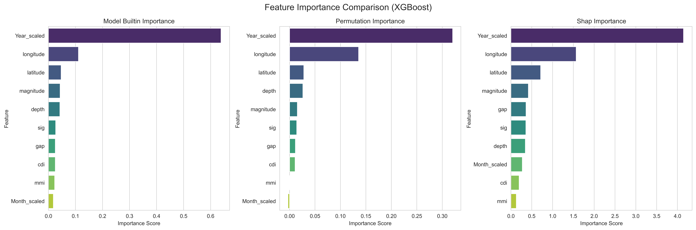

We can find that in all three method, the value of importance of Year_scaled is relatively much higher than others.

And for features excepts Year_scaled and longitude, the difference of values of importance are not so big. For example, in the model builtin importance methods, the 3-rd important feature is latitude and the least important feature is Month_scaled. Their value difference is less than 0.05 which is queit small compared to the imporantance value of Year_scaled is more than 0.6.

As for the Local Feature Importance, we have two force plots:

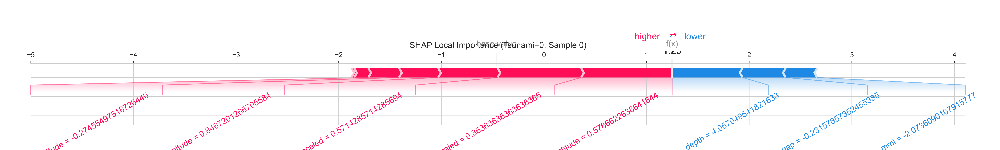

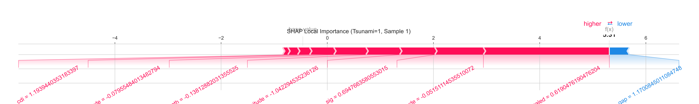

- Tsunami=0 (Sample 0): Features like high depth contribute negatively (red) to "tsunami occurrence", while low magnitude contributes positively (blue), pushing the prediction to "no tsunami".
- Tsunami=1 (Sample 1): Features like high sig (earthquake significance) and high magnitude contribute strongly positively (red), driving the prediction to "tsunami occurrence".

These local results align with physical intuition (high-magnitude/significance earthquakes are more likely to trigger tsunamis).

In the end, the dominance of Year_scaled is unexpected: year is not a physical driver of tsunamis—this pattern likely reflects data bias (more complete/accurate tsunami records in recent years, not a causal relationship).

## Outlook

For the missing value, I tool the strategy of fill NA value using mode and forward value. However, each strategy has the risk to change the distribution of features. By introducing other strategies such as reduced feature method, this risk can be avoided.

For the feature engineering, only basic preprocessing (imputation, scaling) was performed. Adding other processes such as feature interactions, dimensionality reduction may be work.

For the model training part, only n_estimators was optimized for tree based models. Critical parameters such as max_depth and learning_rate for XGBoost were left by defaults.

Year_scaled is the top feature across most model and methods. However, this likely reflects data recording bias rather than a causal relationshipo with tsunai occurrence.

In order to imporve the model, maybe I need to introduce more useful feature engineering such as adding a new feature depth*mmi. Also, feature like Year_scaled and Month_scaled should be processed by some method rathar than directly used.

## Citation

Data source:

Global Earthquake-Tsunami Risk Assessment Dataset, Ahmed Mohamed Zaki
https://www.kaggle.com/datasets/ahmeduzaki/global-earthquake-tsunami-risk-assessment-dataset